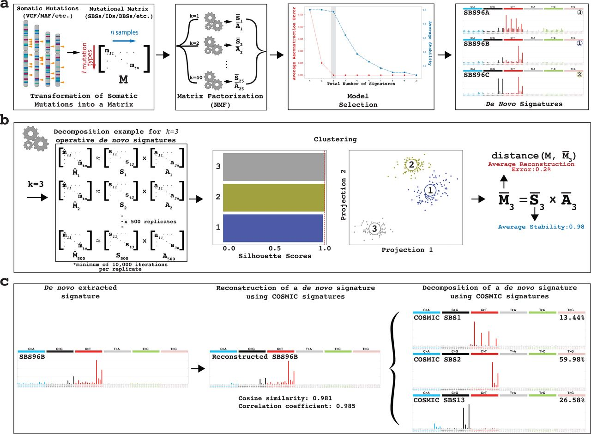
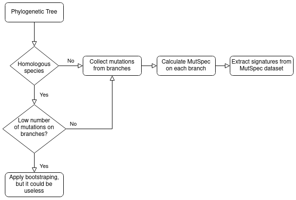

Games with mutational signatures
------------

## Process description

## Plan
- ~use bootstraping (if there are no many mutspec samples)~
- ~Check 1. Run sig extraction on normalized mutspecs and unnormalized. Then normalize signatures of 2nd as we normalize COSMIC. After that compare both normalized signatures by cossim. If they are equal, we can use normalized COSMIC in our normalized mutspecs decomposition.~
- ~Read the [paper](https://www.biorxiv.org/content/10.1101/2020.12.13.422570v2.full) about SigProfilerExtractor~
- ~Check 2. Run extraction on 2 mutspec datasets with different normalization component and compare results for normalized and not mutspecs. Signatures of normalized mutspecs must be more similar than for not normalized - result is obvious. Pass it~ - useless, proved by equations below
- Look at another [signature database](https://signal.mutationalsignatures.com/explore/mutagens)
- Extract normalized signatures from different datasets

## Signatures Purpose
- Nature of mutagens
- Comparison of different mutspecs in terms of shares of different mutational processes
- *Extraction of new signatures of mutational processes (long lived mammals, hot fishes etc.)* - questionable aim, because novel extracted signatures must be validated by wet experiments and must be biologically reasonable
- 

## Open questions
- ~Why can we use normalized database of signatures?~
- ~Do we need positive or negative controls?~ Negative and/or negative controls was implemented by Alexandrov et al. by assessing the tool (we can repeat). Positive control could be implemented using mutation accumulation experiments with distinct mutagens as in Kucab, 2019. 
- How to sample mutational spectra from phylogenetic tree? Decomposition of one mutspec don't use the power of NMF. But if we sample mutspecs from different clades of tree we can extract different mutational processes. - If mean phylogenetic distance of branches is huge as in birds tree, we should use branch mutational spectra for decomposition because of huge number of mutations (200-1000). Else we should somehow sample mutspec from clades or use overall mutspec of full tree as in case of coronavirus or hominida trees

## Simple equations about normalized sig-db
<!-- $$
M = S \cdot A \\
n \cdot M' = n \cdot S' \cdot A \\
M' = S' \cdot A
$$ -->

 
 

Where: 
M - raw Mutational spectra matrix in human (or mice, depends on COSMIC) genome; 
S - Signatures matrix; 
A - Activation matrix, indicating representation of each signature in each sample; 
n - Normalization vector, that contains trinucleotide frequencies of used genome; 
X' - normalized X matrix without genome connection.

## Reference genomes:
- COSMIC, Kucab et al. use **GRCh37**;
- [Zhivagui, 2019](https://signal.mutationalsignatures.com/explore/study/5) use **GRCh38**, but we ignore it, because Signal have only signature from this work

## References
1. [SigProfilerExtractor repo](https://github.com/AlexandrovLab/SigProfilerExtractor). Contains links to wiki that is not about latest release, but main concept understandable, especially output description. Latest main functionality description contains in repo readme (in wiki there are old version)
2. [Paper](https://www.nature.com/articles/s41598-021-04207-6) about coparison of different mutational signature softwares
2. [Alexandrov preprint [2020]](https://www.biorxiv.org/content/10.1101/2020.12.13.422570v2.full) Uncovering novel mutational signatures by de novo extraction with SigProfilerExtractor. **About SigProfilerExtractor methods** ~TODO read~
3. [Alexandrov paper [2020]](https://www.nature.com/articles/s41586-020-1943-3) The repertoire of mutational signatures in human cancer. About COSMIC update and current signatures in general. **TODO read**
4. [Alexandrov paper [2013]](https://www.ncbi.nlm.nih.gov/pmc/articles/PMC3588146/) Deciphering Signatures of Mutational Processes Operative in Human Cancer - **mathematical concept of mutational signatures**, **TODO read**
4. [Kucab, 2019](https://pubmed.ncbi.nlm.nih.gov/30982602/)(Serena's paper) A Compendium of Mutational Signatures of Environmental Agents. **Most Signal signatures are from here. Ester said they didn't use the normalization and fourfold sites filtration**
5. ...

