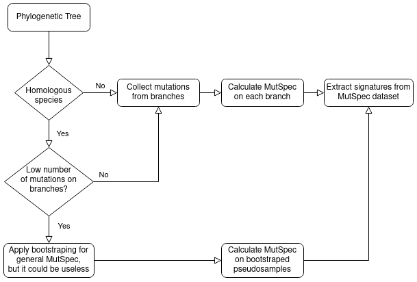

Games with mutational signatures
------------

## Plan
- use bootstraping (if there are no many mutspec samples)
- Check 1. Run sig extraction on normalized mutspecs and unnormalized. Then normalize signatures of 2nd as we normalize COSMIC. After that compare both normalized signatures by cossim. If they are equal, we can use normalized COSMIC in our normalized mutspecs decomposition.
- Read the [paper](https://www.biorxiv.org/content/10.1101/2020.12.13.422570v2.full) about SigProfilerExtractor
- ~~Check 2. Run extraction on 2 mutspec datasets with different normalization component and compare results for normalized and not mutspecs. Signatures of normalized mutspecs must be more similar than for not normalized - result is obvious. Pass it ~~
- Look at another [signature database](https://signal.mutationalsignatures.com/explore/mutagens)
- Extract normalized signatures from different datasets

## Signatures Purpose
- Nature of mutagens
- Comparison of different mutspecs in terms of shares of different mutational processes
- Extraction of new signatures of mutational processes (long lived mammals, hot fishes etc.)
- 

## Open questions
- Why can we use normalized database of signatures?
- Do we need positive or negative controls?

## References
1. [SigProfilerExtractor repo](https://github.com/AlexandrovLab/SigProfilerExtractor). Contains links to wiki that is not about latest release, but main concept understandable, especially output description. Latest main functionality description contains in repo readme (in wiki there are old version)
2. [Paper](https://www.biorxiv.org/content/10.1101/2020.12.13.422570v2.full) about SigProfilerExtractor methods
2. [Paper](https://www.nature.com/articles/s41598-021-04207-6) about coparison of different mutational signature softwares
3. [Alexandorv paper [2020]](https://www.nature.com/articles/s41586-020-1943-3) about COSMIC update and current signatures in general. **Need to read**
4. Serena's papers
5. ...

